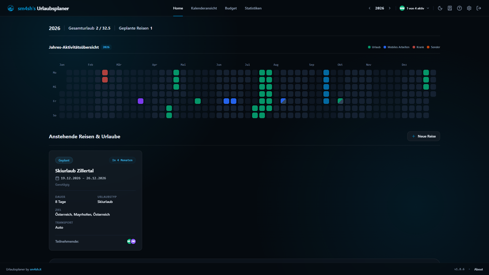
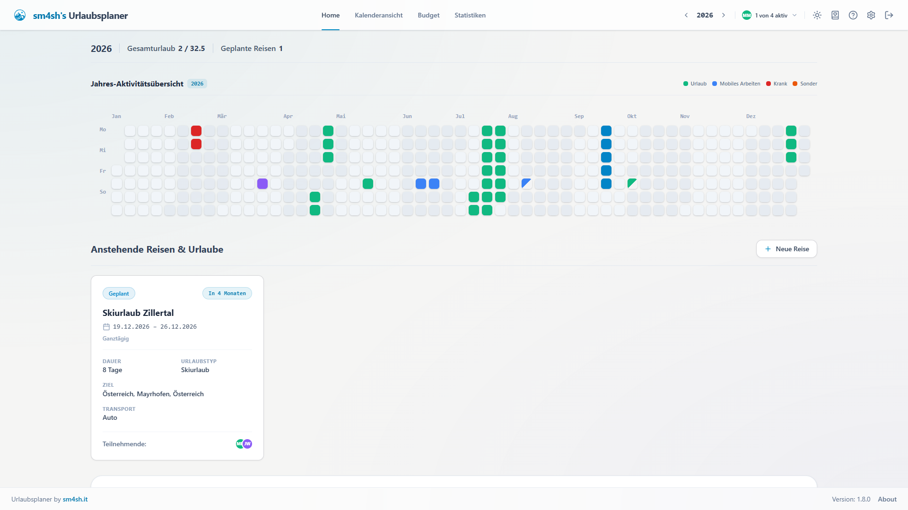
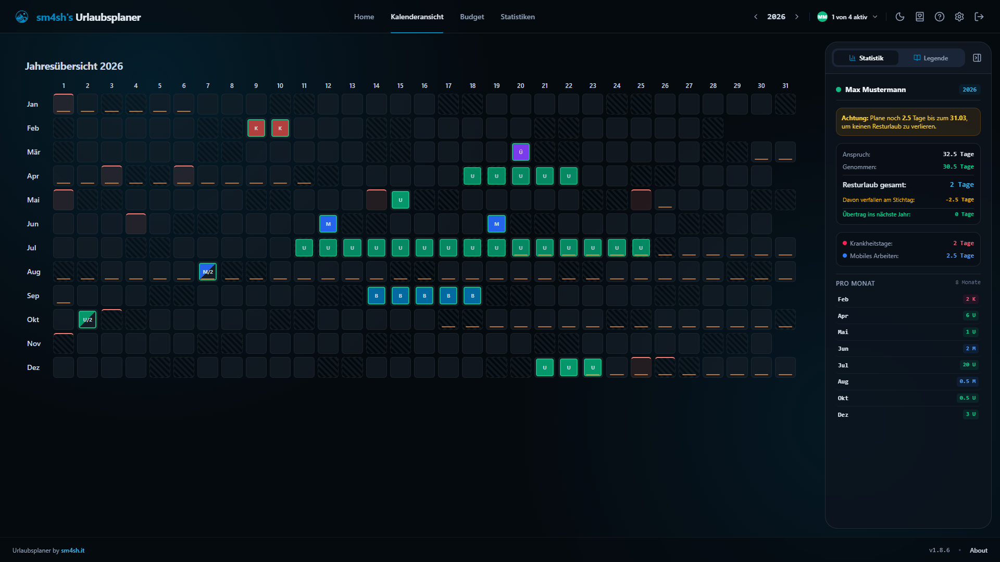
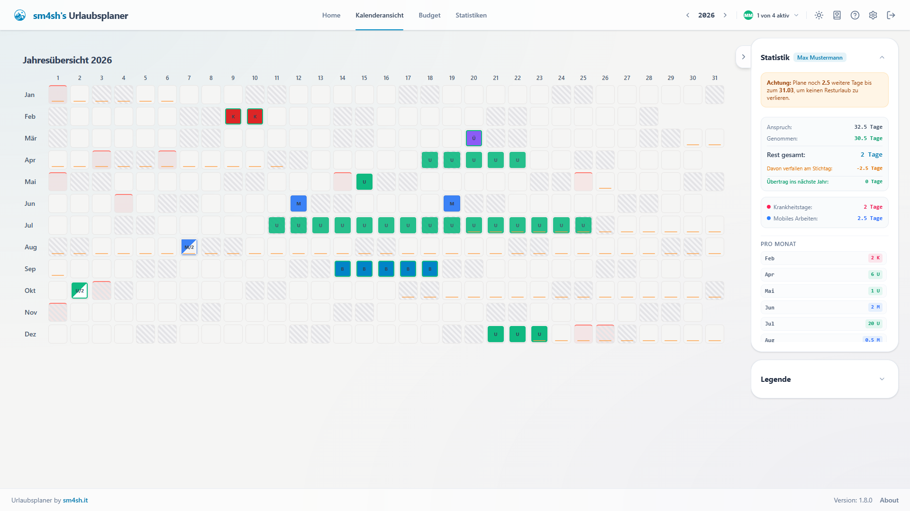
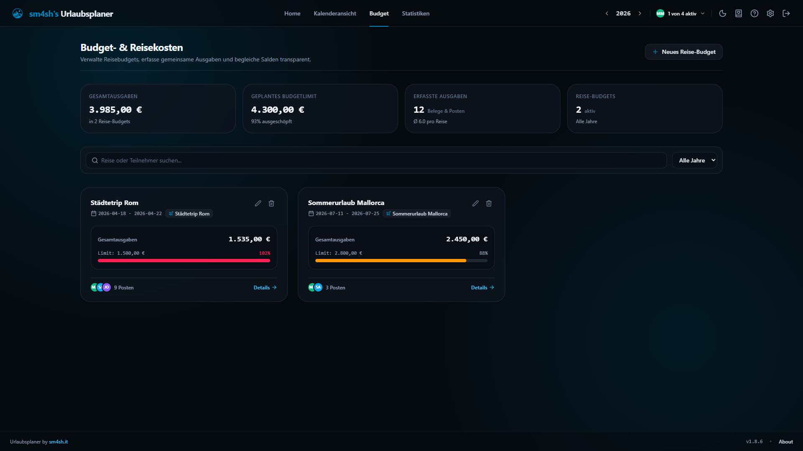
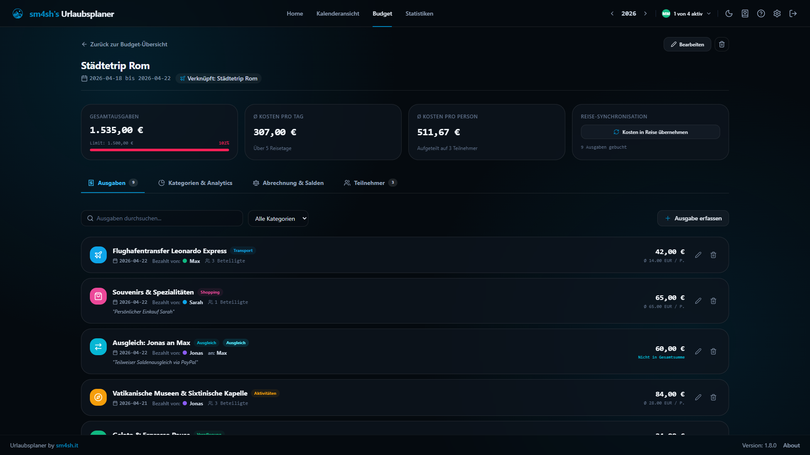
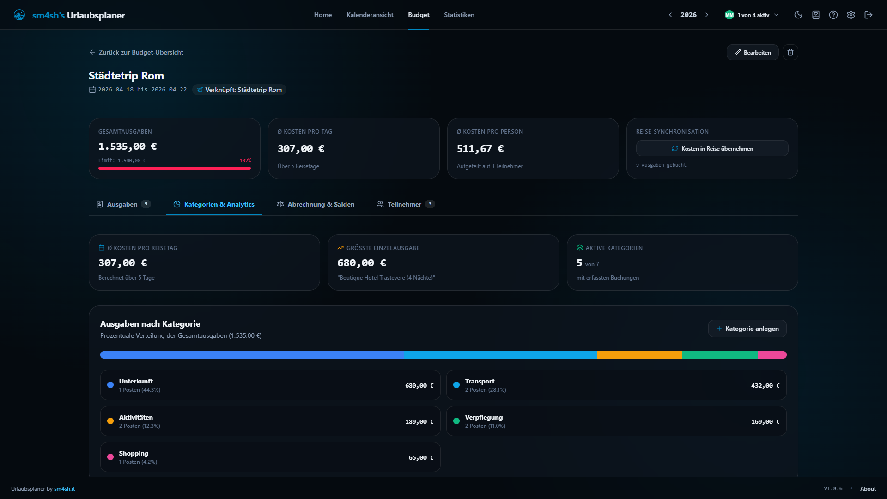
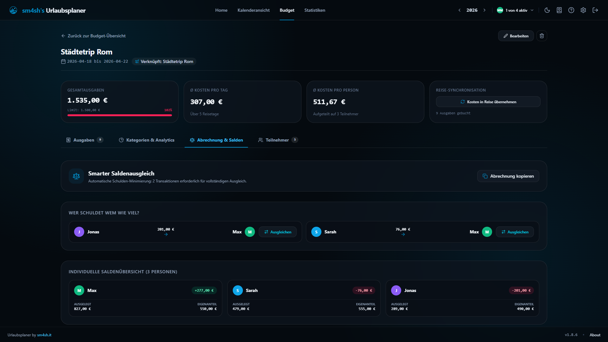
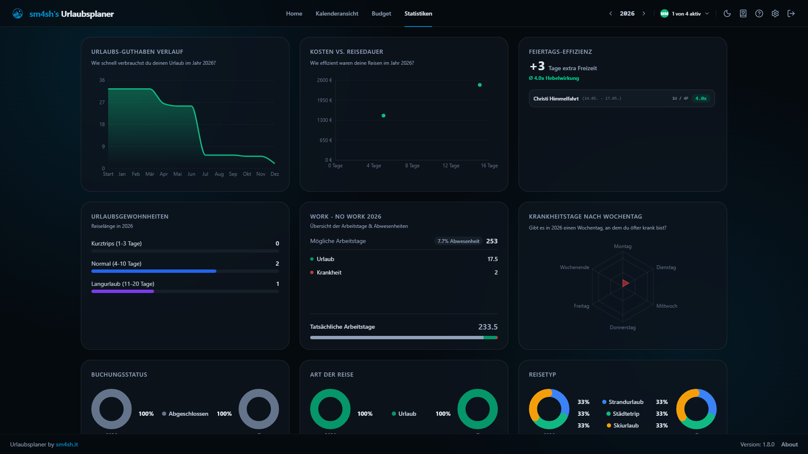

# sm4sh's Urlaubsplaner

**sm4sh's Urlaubsplaner** wurde entwickelt, damit du deine freie Zeit optimal planen und dein Urlaubsbudget immer perfekt im Blick behalten kannst – ganz für dich allein oder gemeinsam mit deinen Liebsten.

Statt manuellem Rechnen bietet dir die App eine klare Jahresübersicht inklusive automatischer Verwaltung deiner Urlaubstage, Schulferien und gesetzlicher Feiertage. Kombiniert mit dem intuitiven, tastaturgesteuerten Interface wird die Urlaubsplanung so schnell, übersichtlich und völlig stressfrei.

## Features
- **Alles auf einen Blick:** Übersichtliche Jahresdarstellung für Desktop-Monitore.
- **Tastaturgesteuert:** Blitzschnelle Eingabe per Tastendruck (`U` für Urlaub, `K` für Krank, `M` für Mobiles Arbeiten, `Shift+U` / `Shift+M` für halbe Tage).
- **Multi-User fähig:** Profile für verschiedene Personen mit eigenen Farben anlegen und gleichzeitig im Kalender vergleichen.
- **Reisen & Halbtage:** Ganztägige und halbe Reisen (Vormittag/Nachmittag) planen inkl. automatischer Urlaubs-Abzüge und Transportmittel-Erfassung (z.B. Bus, Flugzeug, Auto).
- **ICS-Kalenderexport:** 1-Klick-Export beliebiger Reisen als standardisierte `.ics`-Datei (RFC 5545) für Apple Kalender, Google Kalender und Microsoft Outlook.
- **Budget- & Reisekostenverwaltung:** Reisebudgets festlegen, gemeinsame Ausgaben flexibel aufteilen (gleichmäßig oder individuell), Kategorien auswerten und automatischer Saldenausgleich (*„Wer schuldet wem wie viel?“*) mit 1-Klick-Abrechnungsexport.
- **Auto-Sync:** Feiertage und Schulferien aller deutschen Bundesländer werden automatisch geladen.
- **Statistiken & Resturlaub:** Detailliertes Dashboard mit Burn-Down-Charts, Verfallsdatum-Warnung und Transportmittel-Auswertungen.
- **Sicher & Self-Hosted:** Optionaler Passwortschutz (`AUTH_ENABLED`) und einfaches Hosting via Docker.

## Screenshots

### 📊 Dashboard & Jahres-Aktivitätsübersicht
| 🌙 Dark Mode (Midnight Glass) | ☀️ Light Mode (Clean Stone) |
| :---: | :---: |
|  |  |

### 📅 Jahreskalender mit Schnell-Legende & Tastatursteuerung
| 🌙 Dark Mode (mit Seitenleiste) | ☀️ Light Mode (Kalenderübersicht) |
| :---: | :---: |
|  |  |

### 💰 Budget- & Reisekostenverwaltung
| Hauptübersicht & KPIs | Belegerfassung & flexible Splits |
| :---: | :---: |
|  |  |

| Ausgaben nach Kategorien | Smarter Saldenausgleich |
| :---: | :---: |
|  |  |

### 📈 Statistiken & Urlaubsanalyse


## Installation via Docker Compose (Empfohlen)

Die einfachste Möglichkeit, den Urlaubsplaner zu betreiben, ist über Docker Compose:

```yaml
services:
  urlaubsplaner:
    # Dieses Image wird von der GitHub Action automatisch gebaut
    image: ghcr.io/sm4sh-it/urlaubsplaner:latest
    container_name: sm4sh-urlaubsplaner
    restart: always
    ports:
      - "8666:8666"
    volumes:
      # Datenbank-Verzeichnis persistent speichern
      - urlaubsplaner_data:/app/data
    environment:
      # Passwortschutz aktivieren (true) oder deaktivieren (false)
      - AUTH_ENABLED=true
      # Das gewünschte Passwort
      - APP_PASSWORD=sm4sh

volumes:
  urlaubsplaner_data:
```

Starte den Container mit:
```bash
docker compose up -d
```
Die App ist nun unter `http://localhost:8666` erreichbar.

## Absicherung (Globales Passwort)
Der Urlaubsplaner bringt ein eingebautes Authentifizierungssystem mit:
- **Passwortschutz aktivieren (`AUTH_ENABLED=true`):** Die App ist gesperrt. Es MUSS ein Passwort im Feld `APP_PASSWORD` hinterlegt werden.
- **Passwortschutz deaktivieren (`AUTH_ENABLED=false`):** Die App ist direkt ohne Passworteingabe zugänglich (z.B. für die Nutzung im heimischen LAN/VPN oder hinter einem eigenen Reverse-Proxy).

## Danksagung
Ein großes Dankeschön geht an die Bereitsteller der kostenfreien APIs für Feiertage und Schulferien:
- **[ferien-api.de](https://ferien-api.de/)** – Schulferien in Deutschland
- **[feiertage-api.de](https://feiertage-api.de/)** – Gesetzliche Feiertage der Bundesländer

## Lizenz
Dieses Projekt steht unter der **[PolyForm Noncommercial License 1.0.0](LICENSE)**.

- ✅ **Erlaubt:** Kostenlose private Nutzung, Modifikation und Self-Hosting für Familien, Freunde, Vereine und den Eigenbedarf.
- ❌ **Untersagt:** Kommerzielle Nutzung, Weiterverkauf oder das kostenpflichtige Anbieten als gehosteter Cloud-Dienst (SaaS) ohne vorherige schriftliche Genehmigung des Urhebers.
